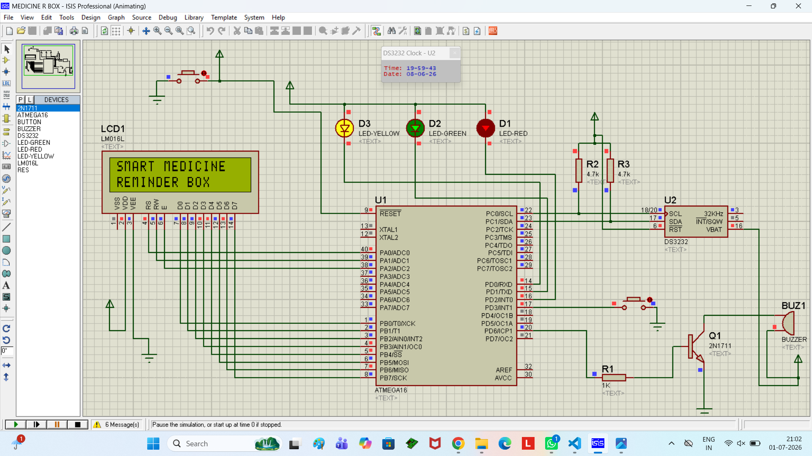
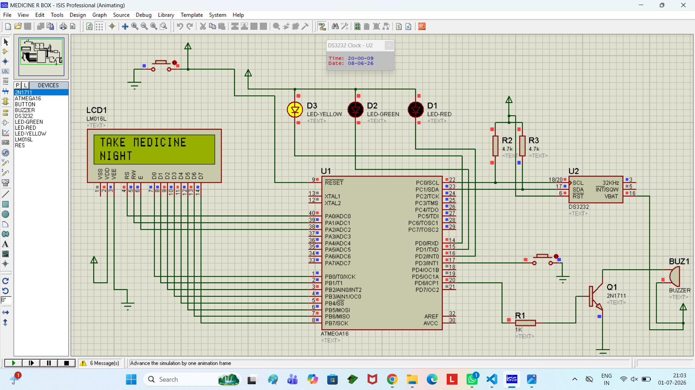
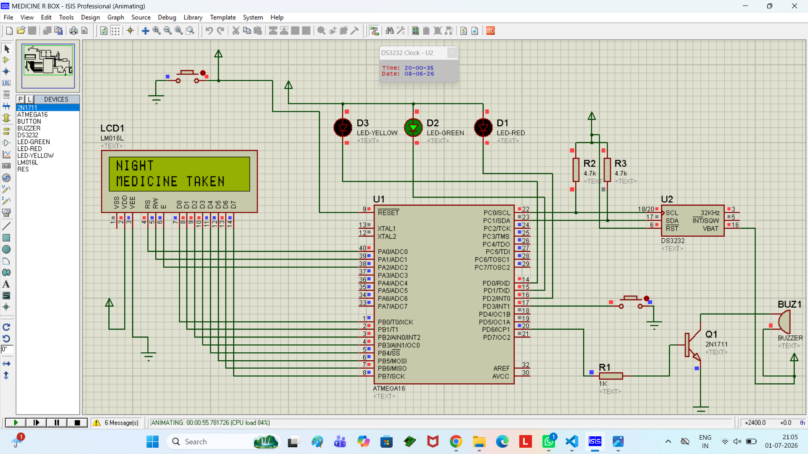

# 💊 Smart Medicine Reminder Box

A smart embedded system that reminds users to take their medicines on time using programmable reminders and audio/visual alerts. This project is designed to improve medication adherence, especially for elderly people and patients who need to take medicines at fixed intervals.

---

## 📌 Project Overview

The **Smart Medicine Reminder Box** is an Arduino-based embedded system that alerts the user at scheduled medicine times. When the preset time is reached, the system activates a buzzer and displays a reminder on the LCD. The user can acknowledge the reminder by pressing a button, making the system simple and easy to use.

---

## ✨ Features

* ⏰ Real-Time Medicine Reminder
* 🔔 Buzzer Alert for Medicine Time
* 📟 LCD Display for Notifications
* 🖲️ Push Button for Reminder Acknowledgement
* 💊 Multiple Medicine Reminder Support (if programmed)
* ⚡ Low Power Embedded Design
* 👨‍⚕️ User-Friendly Interface

---

## 🛠️ Hardware Components

* Arduino Uno
* RTC Module (DS3231/DS1307)
* 16×2 LCD Display (I2C)
* Buzzer
* Push Buttons
* LEDs (Optional)
* Breadboard
* Jumper Wires
* USB Cable / Power Supply

---

## 💻 Software Used

* Arduino IDE / Visual Studio Code
* Arduino C++
* Git & GitHub

---

## ⚙️ Working Principle

1. The RTC module continuously keeps track of the current time.
2. Medicine reminder times are stored in the Arduino program.
3. When the current time matches a scheduled reminder:

   * The buzzer starts ringing.
   * A reminder message appears on the LCD.
4. The user presses the acknowledgement button after taking the medicine.
5. The alarm stops and the system waits for the next scheduled reminder.

---

## 📂 Project Structure

```text
Smart-Medicine-Reminder-Box/
│── Smart_Medicine_Reminder_Box.ino
│── README.md
│── images/
│── circuit/
│── docs/
```

---

## 🚀 How to Run

1. Clone this repository.
2. Open the `.ino` file in Arduino IDE or VS Code.
3. Install the required libraries.
4. Connect the hardware according to the circuit diagram.
5. Select the correct board and COM port.
6. Upload the code to the Arduino Uno.
7. Set the correct date and time on the RTC module.
8. The system is now ready to remind users to take their medicines.

---

## 📸 Project Images









---

## 🎯 Applications

* Elderly Care
* Home Healthcare
* Hospitals
* Clinics
* Personal Medication Management

---

## 🔮 Future Improvements

* Wi-Fi based notifications
* Mobile App Integration
* SMS or WhatsApp Alerts
* Voice Reminder
* Cloud Data Logging
* IoT Dashboard
* Battery Backup
* Automatic Pill Detection

---

## 👨‍💻 Author

**Suman Kumar**

Electronics & Communication Engineering (ECE)

Interested in Embedded Systems, IoT, Arduino, and Software Development.

---


